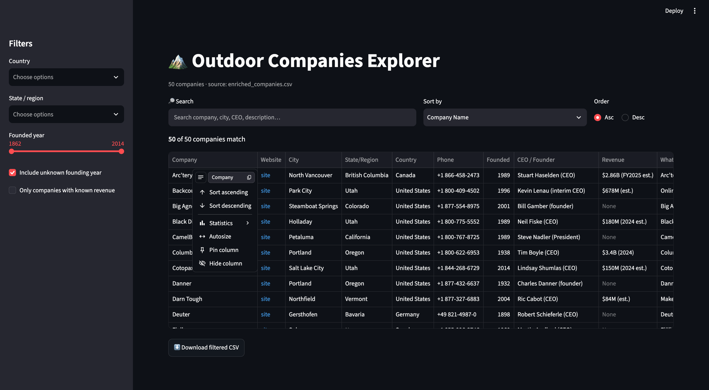

# CAIO — Apparel Company Enrichment Agent

Class project: an AI agent that takes a bare spreadsheet of apparel/outdoor
company names ([`starter_companies.csv`](starter_companies.csv)) and
augments it with rich, verified data — official website, headquarters
location, phone number, founding year, current CEO/founder, annual revenue,
and industry description — writing the result to `enriched_companies.csv`.

## Project layout

```
CAIO/
├── enrich_companies.py        # the enrichment agent (main script)
├── starter_companies.csv      # input: bare list of company names
├── enriched_companies.csv     # output: verified, enriched dataset
├── agent-ui.png          # screenshot of the Streamlit UI
├── README.md
├── python/                    # supporting scripts
│   ├── app.py                 #   Streamlit UI (search / sort / filter)
│   ├── run_ui.sh              #   launches the UI on the local network
│   └── diff_companies_skill.py#   diff tool used by the refresh skill
└── .claude/skills/refresh-companies/
    └── SKILL.md               # the /refresh-companies skill definition
```

## How the agent works

`enrich_companies.py` reads each company name and, for every row, launches
the [Claude Code CLI](https://docs.claude.com/en/docs/claude-code) in
non-interactive ("headless") mode with the **WebSearch** tool enabled. Claude
searches the web, verifies the company's details, and returns a strict JSON
object (validated against a JSON Schema) which the script parses into a new
CSV row. Several companies are looked up in parallel to keep the whole sheet
fast.

This uses your existing Claude subscription through the CLI — there's no
separate API key, and the agent script only depends on the Python standard
library (no `pip install` required).

## One-time setup

1. **Log in to Claude Code** (opens a browser to authenticate):
   ```
   claude auth login
   ```
2. Confirm you're logged in:
   ```
   claude auth status
   ```

## Running it

```
cd ~/CAIO
python3 enrich_companies.py
```

Useful flags:

| Flag | Purpose |
|---|---|
| `--limit 5` | Only process the first 5 rows (quick test) |
| `--workers 8` | Look up more companies in parallel (default: 5) |
| `--input other.csv` | Use a different input file |
| `--output other_out.csv` | Write to a different output file |

Progress prints live to the terminal as each company finishes. Any company
that fails after retries is marked `FAILED: <reason>` in the
`enrichment_status` column of the output — safe to re-run just those rows
later.

## Publishing updates to GitHub

```
cd ~/CAIO
git add enriched_companies.csv
git commit -m "Enrich companies with location, phone, and website data"
git push
```

(Requires `gh auth login` to have been run once so `git push` is
authenticated.)

## Explore the data (Streamlit UI)

A local web app to **search, sort, and filter** the enriched dataset, viewable
from any device on your local network.



One-time setup (creates a self-contained virtualenv with a modern Streamlit —
the system/Anaconda Python on this machine is too old):

```
python3 -m venv .venv
.venv/bin/pip install streamlit pandas
```

Then launch it any time:

```
./python/run_ui.sh       # auto-uses .venv; serves on the local network
```

Streamlit prints a **Network URL** (e.g. `http://192.168.1.23:8501`) — open it
on your phone or another laptop on the same Wi-Fi. The UI has a search bar,
a sort control (plus click-to-sort column headers), sidebar filters (country,
state/region, founding-year range, revenue-known), and a "download filtered
CSV" button.

## Weekly refresh

Re-run the agent and see exactly what changed since last time with the
`/refresh-companies` skill (defined in
[`.claude/skills/refresh-companies/SKILL.md`](.claude/skills/refresh-companies/SKILL.md)).
It snapshots the current data, re-enriches every company, and prints a
**field-level changelog** (added/removed companies and cell-by-cell edits)
via `python/diff_companies_skill.py`.
